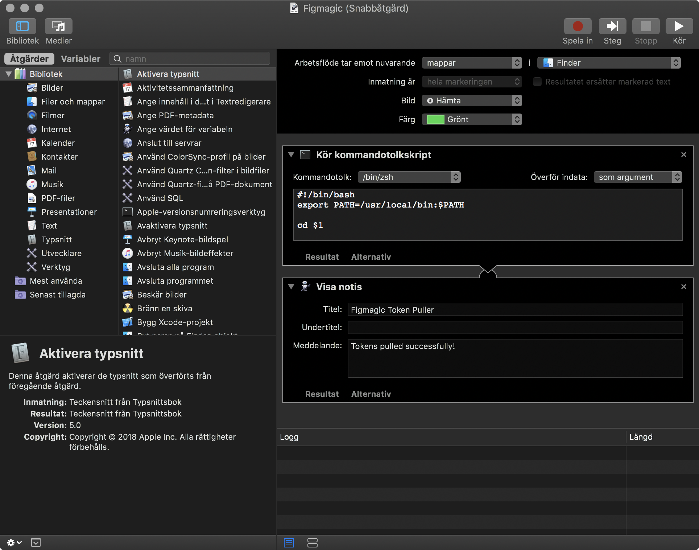

# Mac OS X Automator service for Figmagic

This is a small helper service to make it a snap to update tokens. I've made it specially for those users (like designers) who may have access to code but don't like poking around with webservers and stuff just to get their tokens updated.

## Prerequisites

- You are running a Mac OS X system
- The service expects you to have NPM/Node installed
- The service expects you to have a script in your `package.json` called `figmagic` that runs it locally, like this:

```
"scripts": {
  "figmagic": "./node_modules/figmagic/index.mjs"
}
```

This is the way that for example my own [Figmagic example](https://github.com/mikaelvesavuori/figmagic-example) is structured.

## Installation

- Double click the workflow file, `Figmagic.workflow`, to install it

## Using it

- Right click a folder, and you should see `Figmagic` under the Services category

## Source code

The tiny script that gets run is available under `Figmagic.sh`.

## Automator configuration


_How the service is configured in Automator_
